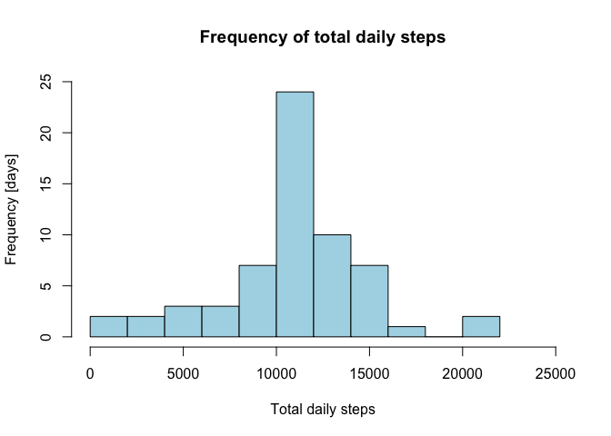

# Reproducible Research: Peer Assessment 1

### Author: Manuel Meretto (May 2015)

### Introduction

It is now possible to collect a large amount of data about personal movement using activity monitoring devices such as a Fitbit, Nike Fuelband, or Jawbone Up. These type of devices are part of the "quantified self" movement -- a group of enthusiasts who take measurements about themselves regularly to improve their health, to find patterns in their behavior, or because they are tech geeks. But these data remain under-utilized both because the raw data are hard to obtain and there is a lack of statistical methods and software for processing and interpreting the data.

This assignment makes use of data from a personal activity monitoring device. This device collects data at 5 minute intervals through out the day. The data consists of two months of data from an anonymous individual collected during the months of October and November, 2012 and include the number of steps taken in 5 minute intervals each day.

### Data 

The variables included in this dataset are:

 - steps: Number of steps taking in a 5-minute interval (missing values are coded as NA)

 - date: The date on which the measurement was taken in YYYY-MM-DD format

 - interval: Identifier for the 5-minute interval in which measurement was taken

The dataset is stored in a comma-separated-value (CSV) file and there are a total of 17,568 observations in this dataset.

### Loading and preprocessing the data

Reading personal activity data from the activity.csv file: 


```r
personalActivityData <- read.csv ("activity.csv", header = T, sep = ",", stringsAsFactors = F)
```

Converting date column from character to Date format:


```r
personalActivityData$date <- as.Date(personalActivityData$date, "%Y-%m-%d")
```

Giving an overview of the dataset:

 - Structure:
 

```r
 str(personalActivityData)
```

```
## 'data.frame':	17568 obs. of  3 variables:
##  $ steps   : int  NA NA NA NA NA NA NA NA NA NA ...
##  $ date    : Date, format: "2012-10-01" "2012-10-01" ...
##  $ interval: int  0 5 10 15 20 25 30 35 40 45 ...
```

- First few rows:  


```r
head(personalActivityData)
```

```
##   steps       date interval
## 1    NA 2012-10-01        0
## 2    NA 2012-10-01        5
## 3    NA 2012-10-01       10
## 4    NA 2012-10-01       15
## 5    NA 2012-10-01       20
## 6    NA 2012-10-01       25
```

### What is mean total number of steps taken per day?

Using dplyr package to group and summarize data. Total daily steps and mean number of daily steps are stored in a variable called AverageDay:


```r
library(dplyr)
```

```
## 
## Attaching package: 'dplyr'
## 
## The following object is masked from 'package:stats':
## 
##     filter
## 
## The following objects are masked from 'package:base':
## 
##     intersect, setdiff, setequal, union
```

```r
AverageDay <- personalActivityData %>% 
                group_by(date) %>% 
                        summarize(total.steps = sum(steps, na.rm = T), 
                                mean.steps = mean(steps, na.rm = T))
```

Plotting histogram of total daily steps:


```r
hist(AverageDay$total.steps, 10,
        main="Frequency of total daily steps",
                xlab="Total daily steps",
                        ylab = "Frequency [days]",
                                xlim=c(0,25000),
                                        ylim=c(0,20),
                                                col="lightblue")
```

 

Summarising total daily steps: 


```r
summary(AverageDay$total.steps)
```

```
##    Min. 1st Qu.  Median    Mean 3rd Qu.    Max. 
##       0    6778   10400    9354   12810   21190
```

More precisely, the mean is 9354.23 and the median is 10395.

### What is the average daily activity pattern?

Grouping data by interval and calculating the mean of each interval:


```r
AverageInterval <- personalActivityData %>% group_by(interval) %>%
                        summarize(mean.steps = mean(steps, na.rm = T))
```

Plotting histogram of total daily steps:


```r
plot(AverageInterval$mean.steps ~ AverageInterval$interval,
        type="l",
                lwd=3,
                        main="Average daily activity",
                                xlab="Interval",
                                        ylab = "Average number of steps",
                                                col="lightblue")
```

 

The 5-minute interval which contains the maximum number of steps (206.1698) is the interval number 835 in the plot.

### Imputing missing values

Calculating the total number of missing values in the dataset:


```r
sum(is.na(personalActivityData$steps))
```

```
## [1] 2304
```

Creating the new dataset that includes NAs: 


```r
newPersonalActivityData <- personalActivityData
```

Filling NAs values with average number of steps:


```r
for (i in 1:nrow(newPersonalActivityData)) {
        if (is.na(newPersonalActivityData$steps[i])) {
            index <- newPersonalActivityData$interval[i]
            value <- subset(AverageInterval, interval==index)
            newPersonalActivityData$steps[i] <- value$mean.steps
      }
}

head(newPersonalActivityData)
```

```
##       steps       date interval
## 1 1.7169811 2012-10-01        0
## 2 0.3396226 2012-10-01        5
## 3 0.1320755 2012-10-01       10
## 4 0.1509434 2012-10-01       15
## 5 0.0754717 2012-10-01       20
## 6 2.0943396 2012-10-01       25
```

As done before, using dplyr package to group and summarize data. Total daily steps are stored in a variable called newAverageDay:


```r
newAverageDay <- newPersonalActivityData %>% group_by(date) %>%
                        summarize(total.steps = sum(steps, na.rm = T))
```

Plotting histogram of total daily steps:


```r
hist(newAverageDay$total.steps, 10,
        main="Frequency of total daily steps",
                xlab="Total daily steps",
                        ylab = "Frequency [days]",
                                xlim=c(0,25000),
                                        ylim=c(0,25),
                                                col="lightblue")
```

 

Filling values with the average number of steps increases the frequencies in the related class.

Summarising total daily steps: 


```r
summary(newAverageDay$total.steps)
```

```
##    Min. 1st Qu.  Median    Mean 3rd Qu.    Max. 
##      41    9819   10770   10770   12810   21190
```

More precisely, the mean is 1.0766189\times 10^{4} and the median is 1.0766189\times 10^{4}.

As a consequence of our strategy, the 1st quantile moves closer to mean and median. The distribution is more concentrated around the center.

### Are there differences in activity patterns between weekdays and weekends?

Creating a new factor variable in the dataset with two levels indicating whether a given date is a weekday or weekend day:


```r
newPersonalActivityData$day <- ifelse(weekdays(newPersonalActivityData$date) %in% 
                                        c("Saturday", "Sunday"), "weekend", "weekday")
```

Creating two subsets containing weekend and weekday data:


```r
weekendActivity <- filter(newPersonalActivityData, day == "weekend")
weekdayActivity <- filter(newPersonalActivityData, day == "weekday")
```

Grouping by intervals and calculating the average number of steps for each interval, then merging datasets into one ("newInterval"):


```r
weekendActivity <- weekendActivity %>%
                        group_by(interval) %>%
                                summarize(mean.steps = mean(steps)) 
weekendActivity$day <- "weekend"

weekdayActivity <- weekdayActivity %>%
                        group_by(interval) %>%
                                summarize(mean.steps = mean(steps)) 
weekdayActivity$day <- "weekday"

newInterval <- rbind(weekendActivity, weekdayActivity)
newInterval$day <- as.factor(newInterval$day)
newInterval$day <- relevel(newInterval$day, "weekend")
```

Creating the two panel plot containing the time series data of the 5-minute interval and the average number of steps taken, averaged across all weekday days or weekend days:


```r
library(ggplot2)
```

```
## Warning: package 'ggplot2' was built under R version 3.1.3
```

```r
g <- ggplot (newInterval, aes(interval, mean.steps))
g + geom_line(colour="red") + 
        facet_grid (day~.) + 
                theme(axis.text = element_text(size = 14), 
                        axis.title = element_text(size = 16)) + labs(y = "Number of Steps") + labs(x = "Interval")
```

 

We can observe that the number of steps is different between weekdays and weekends.
In particular, during weekdays activity has one peak in the morning but it is mainly below 100 steps throughout the day. On the other side, weekend data is more balanced (without important peaks).
